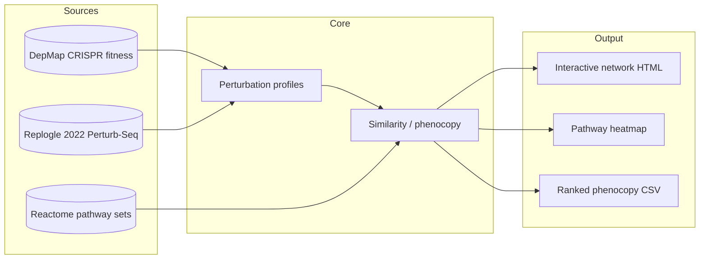

# mitophagy-perturb-atlas

*A queryable atlas of CRISPR perturbation signals over the PINK1/Parkin mitophagy pathway — finds which gene perturbations phenocopy PRKN loss, with the cellular contexts where the signal lives.*

[](https://github.com/arminbayati/mitophagy-perturb-atlas/actions/workflows/ci.yml)  

## What biological question this answers

What do published CRISPR perturbation screens tell us about the
PINK1/Parkin/mitophagy pathway — which gene perturbations phenocopy PRKN
loss, which buffer it, and in which cellular contexts these effects
become visible — and how can we expose that as a queryable atlas?

Plain language: mitophagy is the cell's way of removing broken
mitochondria, and PRKN (Parkin) is one of two recessive PD genes that
directly run this pathway. If we want to find drug targets in this
biology, we need to know which other genes, when perturbed, look like
PRKN loss. This atlas builds that picture from already-published screens.

## Architecture



## Quickstart

```bash
git clone https://github.com/arminbayati/mitophagy-perturb-atlas
cd mitophagy-perturb-atlas
uv sync
./scripts/download_data.sh
uv run mitophagy-perturb-atlas query --gene PRKN
```

## Method

Two perturbation modalities, deliberately kept in separate spaces.

**DepMap fitness screens** give one number per gene per cell line — does
knocking out this gene hurt growth? Aggregated across cell lines, this
yields a fitness profile per gene. Similarity between two genes'
fitness profiles (cosine, with empirical null from random pairings) is
interpretable as "do these two genes have similar dependency landscapes
across contexts?"

**Replogle 2022 Perturb-Seq** gives a transcriptional response signature
per perturbation in K562 and RPE1 cells. Similarity here is "do these two
perturbations produce similar transcriptional consequences?"

These two signals encode different things; joining them in one embedding
is tempting but premature. ADR-0001 keeps them separate.

Pathway definitions come from Reactome ContentService, with the canonical
mitophagy pathway R-HSA-5205647 (PINK1/Parkin-mediated) as the default
scope. Non-canonical receptor-mediated mitophagy (BNIP3/BNIP3L/FUNDC1) is
handled in a parallel pathway view; the README is explicit about which
pathway is in focus where.

## Limitations and honest caveats

- DepMap is cancer cell lines. Convergence with neurodegeneration biology
  is suggestive, not proof.
- Replogle is K562 and RPE1 — not neuronal. Phenocopy in these lines is
  a hypothesis-generating signal at best for PD.
- Screen-design biases differ across studies (CRISPRi vs CRISPRko vs
  CRISPRa, library composition, MOI). Mixing modalities risks artifact;
  cross-platform integration is not attempted by default (ADR-0001).
- USP30 deubiquitinates Parkin substrates — its perturbation is expected
  to look *opposite* to PRKN loss, not similar. Direction of effect
  matters in interpretation, and the network view exposes it.

## What's next
- v0.2.0: full DepMap 24Q2 ingestion + first PRKN-centered network.
- v0.3.0: Replogle integration with empirical-null phenocopy FDR.
- v1.0.0: pathway heatmap, ranked phenocopy CSV, runnable demo notebook.

## Citation
See `CITATION.cff`. BibTeX in the repo's release notes.

## License
MIT.

---
Built by Armin Bayati ([arminbayati.org](https://arminbayati.org)).
